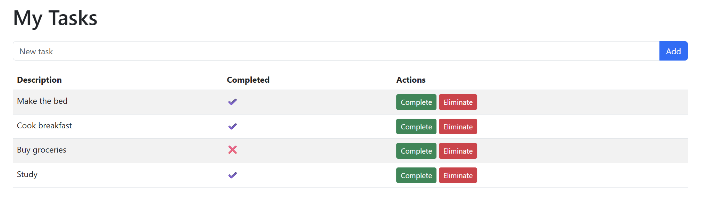

# Task Manager App📝


A simple web application to manage tasks, built with **Spring Boot**, **Thymeleaf**, and **MySQL**. Users can create, view, and delete tasks through a clean HTML interface.

---

## ✨ Features

- ✅ Create new tasks
- 📋 View all existing tasks
- ❌ Delete tasks
- 🌐 Interactive HTML UI using Thymeleaf
- 🧱 Built with Spring Boot (MVC architecture)
- 🗃️ Stores data in a MySQL database

---
## 🌐 Available Languages
[🇪🇸 Español](README.es.md)
---

## 📸 Screenshots



---

## 🛠 Technologies Used
Java 17

Spring Boot

Spring MVC

Thymeleaf

MySQL

Maven

---

## ▶ How to Run
✅ Requirements
- Java 17 or newer

- MySQL running locally

- Apache Maven 3.6+

---

🚀 Steps
1. Clone the repository
```
   git clone https://github.com/Silversoth/task-manager-springboot.git
   cd task-manager-springboot
```
2. Configure database connection
Edit the file src/main/resources/application.properties and update the following values:
```
spring.datasource.url=jdbc:mysql://localhost:3306/your_database
spring.datasource.username=your_username
spring.datasource.password=your_password
spring.jpa.hibernate.ddl-auto=update
```
3. Run the project
```
mvn spring-boot:run
```
4. Access the app in your browser
```   
http://localhost:8080
```
---
## 📂 Project Structure
```
src/
├── main/
│   ├── java/
│   │   └── com.github.silversoth.task_manager/
│   │       ├── controller/       # TaskController.java
│   │       ├── dao/              # TaskRepository.java (Spring Data JPA)
│   │       ├── entity/           # Task.java (JPA Entity)
│   │       └── TaskManagerApplication.java
│   └── resources/
│       ├── templates/            # Thymeleaf views (index.html)
│       └── application.properties
└── test/

```
---
## 🌐 Endpoints Overview
The application exposes the following routes for task management:
```
Method	URL	Description
GET	/tasks	Displays the main page with the list of tasks and a form to add a new task
POST	/tasks	Submits a new task to be saved to the database
GET	/tasks/delete/{id}	Deletes the task with the specified id
GET	/tasks/complete/{id}	Toggles the completion status of a task by id
```
---
## 🧭 Flow Summary
```
1. The home page at /tasks shows all tasks and includes the form to add one.

2. When a task is submitted via the form, it's sent as a POST to /tasks.

3. Clicking delete triggers a GET request to /tasks/delete/{id}.

4. Clicking complete triggers a GET request to /tasks/complete/{id} to toggle its status.
```
---
## 🧪 Testing
Basic test class exists under:
```
src/test/java/com/github/silversoth/task_manager/TaskManagerApplicationTests.java

```
You can run tests with:
```
mvn test
```

---
## 📄 License

This project is licensed under the MIT License.
---
## 👤 Author
Jonathan Hendrix

[GitHub](https://github.com/Silversoth)

[LinkedIn](https://www.linkedin.com/in/jonathan-hendrix-dev/?profileId=ACoAABaHN2MBCx8MlxM46klT3fXvOH9NIHW7b3I)


